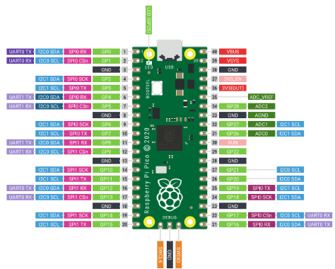

# Entendendo a BitDogLab

A BitDogLab é uma placa desenvolvida no projeto de escola 4.0 da Unicamp. Possui como microcontrolador base um Raspberry, possuindo os modelos Pico Pi H ou W.

## Raspberry Pico Pi

A Raspberry Pi Pico na BitDog Lab é como o "cérebro" que dá vida aos projetos, controlando luzes, sons e sensores. Ela entende sinais elétricos e executa comandos que você programa, como um robô obedecendo ordens simples.

  

Aqui temos uma imagem do que é chamado de “pinagem” da Raspberry Pico Pi. Através dessas informações podemos entender o funcionamento básico de cada porta, as quais damos o nome de GPIO do inglês “General Purpose Input/Output”.

Notasse que quase todas as entradas são GPIO’s as únicas que fogem a essa regra são as portas de GND (Ground do inglês “Chão”), 3V3, RUN, VBUS, VSYS, SWCLK e SWDIO. O uso de parte dessas portas é um pouco avançado mas pode ser resumido da seguinte forma:

GND - É como o fio de volta da energia. Todo circuito precisa de um caminho para a energia ir e voltar. O GND é o retorno, ou seja, é por onde a energia "descarrega".

3V3 - Fornece uma tensão de 3,3 volts. Isso é a energia que a placa usa internamente e que você também pode usar para alimentar sensores e componentes que precisam dessa voltagem.

RUN - Essa porta controla o funcionamento da placa. Se você ligar esse pino ao GND, a placa para de funcionar (como se desligasse). Se ficar desconectado ou em alta, ela roda normalmente.

VBUS - Mostra se o cabo USB está conectado. Ele dá a voltagem (normalmente 5V) vinda do cabo USB.

VSYS - É a fonte principal de energia da placa. Ele alimenta o resto do sistema com base no que estiver disponível — seja o USB ou uma bateria.

SWCLK - Do inglês “Serial Wire Clock”, essa porta serve para receber a frequência de leitura da informação que será enviada para a porta SWDIO

SWDIO - Do inglês “Serial Wire Data I/O”, essa porta serve para receber a informação que será lida na frequência determinada pela entrada da porta SWCLK

Entender as entradas básicas da Raspberry Pico Pi é importante, pois com isso podemos entender as ligações básicas entre os componentes da BitDogLab. 

A Raspberry Pico Pi é um microcontrolador, isso significa que ela foi feita para controlar tarefas simples, como acender um Led, ler um sensor ou acionar motores. Ela não roda um sistema operacional como Windows ou Linux, ao invés disso ela executa códigos previamente programados. É necessário entender que em essência quando se fala em programas a BitDogLab estamos falando em escrever um código que será lido e interpretado pela Raspberry Pico Pi.

## Componentes da BitDogLab

Visto que o microcontrolador é como o “cérebro” da BitDogLab, os componentes podem ser enxergados como os “músculos” e “nervos” dessa placa. Ela possui alguns componentes que vão nos ser muito úteis ao aprendizado e que facilitarão na criação de projetos e o estudo da programação. 

É importante lembrar que esses componentes estão conectados a Raspberry Pico Pi, logo, além de falarmos de suas funções básicas teremos também uma descrição de suas conexões com o microcontrolador, por meio das GPIO’s. O estudo dessas conexões será importante para a programação futura da nossa BitDogLab.

| **Componentes** | **Ligações Raspberry** |
|------------------|-------------------------|
| Display Oled     | GPIO 2 (SDA) GPIO 3 (SCL) |
| Matriz Oled      | GPIO 7                  |
| Microfone        | GPIO 28                 |
| Joystick         | GPIO 26 (VRy) GPIO 27 (VRx) GPIO 22 (SW) |
| Botões           | Botão A: GPIO 10 Botão B: GPIO 5 Botão C: GPIO 6 |
| Buzzers          | GPIO 21                 |
| LED RGB          | LED VERDE: GPIO 11 LED AZUL: GPIO 12 LED VERMELHO: GPIO 13 |

Demais conexões ficam disponíveis para uso e são conectadas para uso diverso.

Para uma comunicação SPI usamos os GPIO16 (RX), GPIO17(CSn), GPIO18 (SCK) e GPIO19 (TX) neste conector IDC. 
Um conector Insulation-Displacement Connector (IDC) box de 14 pinos é usado para expansão de hardware e está assim conectado com a Raspberry Pi Pico: pino 1 com o GND, pino 2 com o 5V, pino 3 com 3V3, pino 4 com GPIO8, pino 5 com o GPIO28, pino 6 com o GPIO9, pino 7 com GND analogico. pino 8 com o GPIO4, pino 9 com o GPIO17, pino 10 com o GND, pino 11 com o GPIO16, pino 12 com GPIO19, pino 13 com o GND, pino 14 com o GPIO18. É neste slot que conectamos as placas de extensão como a BitMovel Motor Driver ou LORA.

## Micropython e linguagens de programação

A raspberry pico pi pode ser programada em 2 linguagens de programação. O micropython e o C. O C é uma das linguagens mais comuns de programação de microcontroladores e de outras aplicações, já foi amplamente usada na indústria. O micropython é uma linguagem  feita especialmente para rodar em microcontroladores, como a Raspberry Pi Pico.

Para facilitar, será visto apenas micropython durante o aprendizado deste programa de estudos.
A documentação dessa linguagem pode ser visualizada em sua página: https://docs.micropython.org/en/latest/
