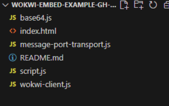
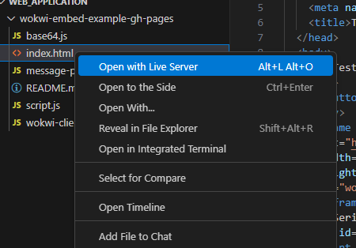

## Guia de uso de aplicação Web

Este guia apresenta o passo a passo para instalar, configurar simulações do Wokwi para uso em aplicações Web.

## **Requisitos**

Antes de começar, certifique-se de ter instalado:

- Visual Studio Code (versão mais recente)

- Conta gratuita no Wokwi (https://wokwi.com)

- Extensão “Wokwi Simulator” para VS Code

- Navegador atualizado (Chrome, Edge ou Firefox)

- Extensão Live Server

## **Instalação da extensão do Wokwi**

1. Abra o VS Code.

2. Acesse o menu lateral Extensions (ícone de quadradinho ou Ctrl + Shift + X).

3. Pesquise por “Wokwi”.

4. Selecione a extensão “Wokwi Simulator” e clique em Install.

Dica: Após a instalação, você verá um novo ícone do Wokwi na barra lateral do VS Code.

## **Configuração de chave Wokwi**

Essa etapa costuma ser simples, pois logo ao abrir a extensão ou algum documento que faz uso da extensão do Wokwi uma janela de configuração de chave aparece, então basta clicar nela que você será direcionado diretamente para o site da plataforma Wokwi. Mas caso essea janela não apareça, essas são as etapas a serem seguidas: 

1. Acesse sua conta no Wokwi (https://wokwi.com
) e faça login.

2. Vá para Settings / Account / API Keys (ou seção similar — pode aparecer como Developer ou Integrations).

3. Crie uma nova API key ou client id. Copie o valor gerado (ex.: wokwi_client_abcd1234...) e então o cole nas configurações da extensão.

## **Instalação da extensão Live Server**

1. Abra o VS Code.

2. Acesse o menu lateral Extensions (ícone de quadradinho ou Ctrl + Shift + X).

3. Pesquise por “Live Server”.

4. Faça a instalação clicando em instalar.

## Aplicação Web (Web-Application)

A aplicação Web utiliza um arquivo index.html que embute o simulador do Wokwi através de um iframe, permitindo a visualização e interação direta com a simulação dentro de uma página Web. Esse modelo é útil para integrar a BitDogLab virtual em sites educacionais, repositórios ou materiais didáticos.

<p align="center">
  
</p>

Iframe (abreviação de inline frame) é uma janela dentro da página que mostra outro site ou conteúdo hospedado em outro lugar.  Nesse caso os, resultados visuais da simulação estão sendo transmitidos do site Wokwi via Iframe para um endereço desejado.

**Index:** O arquivo index.html, mostrado na estrutura básica acima, é quem coordena a forma como a transmissão ocorre. Quando aberto é possível ver certas configurações de transmissão, como o texto da página, botão de início da simulação, fonte base para simulação e output da serial.

Obs: Essa ferramenta de aplicação web ainda é experimental, e portanto ela se comunica com um servidor experimental da wokwi que é voltado para testes (Isso pode ser percebido no trecho src="https://wokwi.com/experimental/embed?client_id=wokwi_client_omf4ejkz6n6twj7d3x2eqmyp")

**Script:** O script.js conterá informações pertinentes a montagem/diagrama do circuito e código main que será rodado no simulador. 

Sua estrutura base é:

```javascript
import { MessagePortTransport } from './message-port-transport.js';
import { WokwiClient } from './wokwi-client.js';

const diagram = `{ (Local do diagrama) }`;

const microPythonCode = `(Local do código main)`;

const outputText = document.getElementById('output-text');

window.addEventListener('message', (event) => {
  const client = new WokwiClient(new MessagePortTransport(event.data.port));

  client.addEventListener('wokwi:connected', async (event) => {
    console.log('Wokwi client connected', event.detail);
    await client.serialMonitorListen();
    await client.fileUpload('main.py', microPythonCode);
    await client.fileUpload('diagram.json', diagram);
  });

  client.addEventListener('serial-monitor:data', (event) => {
    const rawBytes = new Uint8Array(event.detail.bytes);
    outputText.textContent += new TextDecoder().decode(rawBytes);
  });

  document.querySelector('.start-button').addEventListener('click', () => {
    client.simStart({
      firmware: 'main.py',
      elf: 'main.py',
    });
  });
});
console.log('Wokwi ESP32 MicroPython script loaded');
```

Restante da estrutura e suas funções:

**base64:** Conversor de dados binários.

**wokwi-client:** Base do canal de comunicação por iframe.

**message-port-transport:** Interpreta comandos e respostas enviadas e recebidas do servidor Wokwi.

## **Simulando**

Para simular usando a extensão Live Server, basta ter a estrutura em uma pasta e então clicar no arquivo index.html com o botão direito do mouse selecionando a opção "Open with Live Server". Isso fará que a simulação seja aberta no navegador principal da máquina.

<p align="center">
  
</p>
