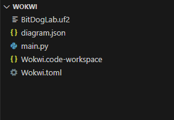
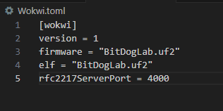

## Guia de uso da extensão do Wokwi para VS Code

Este guia apresenta o passo a passo para instalar, configurar e utilizar a extensão do Wokwi no Visual Studio Code (VS Code), permitindo simular projetos de microcontroladores diretamente do ambiente de desenvolvimento.

## **Requisitos**

Antes de começar, certifique-se de ter instalado:

- Visual Studio Code (versão mais recente)

- Conta gratuita no Wokwi (https://wokwi.com)

- Extensão “Wokwi Simulator” para VS Code

- Navegador atualizado (Chrome, Edge ou Firefox)

- Python (versão mais recente)

## **Instalação da extensão do Wokwi**

1. Abra o VS Code.

2. Acesse o menu lateral Extensions (ícone de quadradinho ou Ctrl + Shift + X).

3. Pesquise por “Wokwi”.

4. Selecione a extensão “Wokwi Simulator” e clique em Install.

Dica: Após a instalação, você verá um novo ícone do Wokwi na barra lateral do VS Code.

## **Configuração de chave Wokwi**

Essa etapa costuma ser simples, pois logo ao abrir a extensão ou algum documento que faz uso da extensão do Wokwi uma janela de configuração de chave aparece, então basta clicar nela que você será direcionado diretamente para o site da plataforma Wokwi. Mas caso essea janela não apareça, essas são as etapas a serem seguidas: 

1. Acesse sua conta no Wokwi (https://wokwi.com
) e faça login.

2. Vá para Settings / Account / API Keys (ou seção similar — pode aparecer como Developer ou Integrations).

3. Crie uma nova API key ou client id. Copie o valor gerado (ex.: wokwi_client_abcd1234...) e então o cole nas configurações da extensão.

## **Executando a simulação**

A estrutura de uma simulação no Wokwi deve seguir a seguinte lógica:

  

A estrutura da simulação pode ser visualizada na pasta [Codigos\Wokwi](https://github.com/JoaoRemondi/BitDogLab_Teaching/tree/main/C%C3%B3digos/Wokwi)

Essa estrutura contém:

**BitDogLab.uf2:** Firmware oficial da BitDogLab

**Diagrama.json:** Contém o diagrama em javascript do modelo de simulação da BitDogLab 

**main.py:** É o código que será executado na simulação da placa

**ssd1306:** Biblioteca da tela Oled

**Wokwi.code-workspace:** Código que dá hierarquia ao workspace

**Wokwi.toml:** Essa parte é importante, pois ela dita como a simulação deve ser interpretada pela API do Wokwi.

  

Como dito o arquivo Wokwi.toml é importante pois ele gera a interação entre o Wokwi e os códigos. O segredo para a execução da simulação está exatamente nesta parte, devido a problemas relacionados a própria API do Wokwi com simulações em micropython, há problemas na inicialização da simulação, portanto, é necessário uma pequena modificação do arquivo Wokwi.toml colocando uma porta de servidor "rfc2217ServerPort = 4000" que será utilizada em conjunto com comandos em python para iniciar a simulação. Também é no Wokwi.toml que o firmware da placa "BitDogLab.uf2" é refenciado.

Passos para  execução:

1. Após a configuração da chave para API, ao abrir o diagrama.json aparecerá no Visual Studio Code uma janela contendo o diagrama visual da simulação.

2. Aperte o botão de start verde para iniciar a simulação, note que a simulação irá iniciar, porém, o código do main.py ainda não está sendo executado. Isso ocorre devido ao problema de carregamento da API do Wokwi.

3. Para carregar o main.py é necessário abrir um novo terminal no Visual studio code e executar o seguinte comando: 

    python -m mpremote connect port:rfc2217://localhost:4000 cp ssd1306.py :ssd1306.py

    python -m mpremote connect port:rfc2217://localhost:4000 cp main.py :main.py

    python -m mpremote connect port:rfc2217://localhost:4000 exec "import main"

Esses comandos são responsáveis por carregar no servidor do Wokwi. Após isso a simulação deve iniciar normalmente.

## **Problemas comuns**

As vezes é necessário não apenas instalar o python em seu computador, mas também referênciar seu caminho nas varáveis de ambiente para que o Visual Studio possa usar o interpretador. Abaixo estão alguns guias de instalação e configuração:

[Guia de configuração do Python](https://www.youtube.com/watch?v=ZBGzx7-KjSM)

